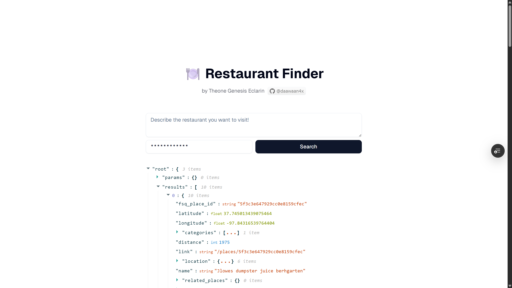

# Restaurant Finder

<div align="center">
	
</div>

Find restaurants and search using natural language

## Development

After cloning the repository, run the following commands to initialize the repo.

```bash
pnpm install		# install project dependencies
```

The following is a list of the primary scripts for the project.

```bash
pnpm run dev		# start development server
pnpm run build		# build project
pnpm run start		# start server for production
pnpm run lint		# lint codebase with ESLint
pnpm run typecheck	# typecheck codebase with Typescript
pnpm run format		# format codebase with Prettier
```

Open [http://localhost:3000](http://localhost:3000) after running `pnpm run dev` to view the website.

## API

This project uses the following tech for the API.

- [ts-rest](https://ts-rest.com/): End-to-end type-safe REST-API
- [Zod](https://zod.dev/): Declarative data validation with user-defined schemas

```
GET /api/execute?message=<string>&code=<string>
```

Use `code=pioneerdevai` to pass authentication.

## Tooling

This project uses the following tools to enforce consistent coding conventions, formatting, and automated workflows:

### Formatting & Linting

- [Prettier](https://prettier.io/): Enforces consistent code formatting.
- [ESLint](https://eslint.org/): Enforces best practices on coding conventions.
- [Typescript](http://typescriptlang.org/): Provides static typing and checks.

### Automation

- [Github Actions](https://github.com/features/actions): Automates CI workflows, including formatting & linting.

## Technical Decisions Made

- **Why NodeJS & Typescript**

  Although I could have used **Python** as well, the decision to use **NodeJS** & **Typescript** was mainly due to the convenience of being able to share types between the frontend and the backend.

  I have used both languages in a work project where **NodeJS** & **Typescipt** was used for the frontend & backend API for _end-to-end type-safety_, but the data-heavy workloads are delegated by the **NodeJS** backend to **Python** workers primarily because of the ecosystem of AI/data-science libraries (and GPU-accelerated ones).

- **Why NextJS?**

  The decision to use **NextJS** was mainly for deployment convinience with Vercel's free tier for both the frontend and backend functionality, and the job description's preference to use **React**.

  Although I could have used a lighter framework for deploying an edge function only, that would have limited me from deciding to make a frontend quickly for the coding challenge in case I changed my mind midway.

- **Why ts-rest?**

  Using **ts-rest** allowed defining the backend API design independently from NextJS' file-based routing, while providing end-to-end typesafety when integrated into the frontend.

  The decision was also made with making a UI for the coding challenge in mind ahead of time, despite it not being required. This also allowed being able to decouple the backend API from the frontend.

- **No automated tests?**

  I currently have not learned of best practices for setting up CI tests for an LLM apps. I would love to learn how this is done properly in real-life projects.

## Assumptions & Limitations

- The [provided Foursquare Places API endpoint](https://docs.foursquare.com/developer/reference/place-search) is apparently depracated and not supported anymore. I decided to implement the app around the corresponding [new API endpoint](https://docs.foursquare.com/fsq-developers-places/reference/place-search) instead.

- The project uses OpenAI's Structured Output feature, to ensure GPT will follow a specific JSON schema for generating the structured query. However, the OpenAI Documentation does not use strong language to guarantee this:

  > ["The model will always try to adhere to the provided schema, which can result in hallucinations if the input is completely unrelated to the schema."]()

  The [system prompt submitted](./src/server/translator/index.ts) includes instruction to return an empty parameter set if GPT deems the search input unrelated or irrelevant for the task. Still, this may not completely defend the app from malicious user intent such as prompt injection attacks.

  For this challenge, the app assumes that the user has no malicious intentions.

- The guideline has the instruction "_Parse the response from the Foursquare API and return a well‑structured JSON object containing key restaurant details._"

  Since the challenge does not include making a UI for the searched places, the implementation left the response **untyped** as `unknown` in the codebase. In addition, the returned JSON results do not have all the response fields documented in the Foursquare Places API. The [documentation](https://docs.foursquare.com/fsq-developers-places/reference/place-search) neither specifies which fields are **`required`** and which ones are **`optional`**.

  This scenario made field extraction tricky e.g. determining which fields are the key fields, since this meant the app might accidentally return `undefined` fields. Fields such as `rating` are also locked behind the Premium API.

  For this, I decided to not transform the returned JSON results anymore, though I believe the language in the guideline _leans towards_ transforming the returned JSON results.
